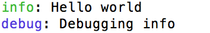
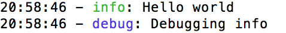

## 非常好用的nodejs日志库-winston

[返回首页](../../README.md)

今天，我们来介绍一款功能强大的的NodeJS日志库-[Winston](https://github.com/winstonjs/winston)。Winston可以被应用在很多场景下，包括Nodeweb框架（比如：Express）和NodeCLI应用。

### Winston入门指南 

首先命令行创建一个文件夹winston-test，并进入。


```shell

$ mkdir winston-test && cd winston-test

```


下一步，创建一个package.json文件，所有的设置保持默认值。


```shell

$ npm init -y

```


安装npm依赖包，winston。


```shell

$ npm install --save winston

```


创建一个js文件，index.js并添加如下内容：


```js
'use strict';
const winston = require('winston');
winston.level = 'debug';
winston.info('Hello world');
winston.debug('Debugging info');
```

执行index.js，现在我们就可以打印消息到控制台了。
```shell
$ node index.js
```


得到如下输出：

```shell
info: Hello world
debug: Debugging info
```

成功啦！！！这样就可以了，是不是很简单！！！

### Winston日志等级 

详细的描述见：[文档](https://github.com/winstonjs/winston#logging-levels)，Winston通过设置不同的整数代表不同的日志等级。在我们上面的例子中，我们利用了“info”and“debug”两种等级。但是，默认情况下，Winston可以设置一下几个等级。


```json
{ error: 0, warn: 1, info: 2, verbose: 3, debug: 4, silly: 5 }
```

Winston还提供了其它日志等级，像syslog，你也可以自定义日志等级。

### 带颜色的日志输出 

给枯燥的日志添加点颜色还是蛮有趣的。实现方式如下：

```js
'use strict';
const winston = require('winston');
const logger = new (winston.Logger)({
  transports: [
    // colorize the output to the console
    new (winston.transports.Console)({ colorize: true })
  ]
});
logger.level = 'debug';
logger.info('Hello world');
logger.debug('Debugging info');
```

设置"colorize"属性，这样可以突出显示相应的日志。运行node，显示如下：



### 给生成的日志添加时间戳 

添加时间戳是非常有用的，可以看到每条记录生成的时间。运行node，显示如下：



### 除了控制台还可以将日志写入到文件中 

设置第二个transport记录日志到文件。


```js
'use strict';
const winston = require('winston');
const fs = require('fs');
const env = process.env.NODE_ENV || 'development';
const logDir = 'log';
// Create the log directory if it does not exist
if (!fs.existsSync(logDir)) {
  fs.mkdirSync(logDir);
}
const tsFormat = () => (new Date()).toLocaleTimeString();
const logger = new (winston.Logger)({
  transports: [
    // colorize the output to the console
    new (winston.transports.Console)({
      timestamp: tsFormat,
      colorize: true,
      level: 'info'
    }),
    new (winston.transports.File)({
      filename: `${logDir}/results.log`,
      timestamp: tsFormat,
      level: env === 'development' ? 'debug' : 'info'
    })
  ]
});
logger.info('Hello world');
logger.warn('Warning message');
logger.debug('Debugging info');
```

当前目录下会产生一个log目录。这里我们添加了env来使得开发环境和正式环境输出不同的日志等级。输入如下命令查看日志：

```shell

$ cd log/
$ vim results.log

```

日志内容如下：

```json

{"level":"info","message":"Hello world","timestamp":"21:10:32"}
{"level":"warn","message":"Warning message","timestamp":"21:10:32"}
{"level":"debug","message":"Debugging info","timestamp":"21:10:32"}

```

### 每天记录日志文件 

最后一个例子，我们将添加一个npm模块（[winston-daily-rotate-file](https://github.com/winstonjs/winston-daily-rotate-file)）每天自动生成一个新的日志文件。这里我们顺便演示下如何直接从github上安装npm包而不是从npm仓库。


```shell

$ npm install --save https://github.com/winstonjs/winston-daily-rotate-file/tarball/master

```


实现方式如下：


```js
'use strict';
const winston = require('winston');
const fs = require('fs');
const env = process.env.NODE_ENV || 'development';
const logDir = 'log';
// Create the log directory if it does not exist
if (!fs.existsSync(logDir)) {
  fs.mkdirSync(logDir);
}
const tsFormat = () => (new Date()).toLocaleTimeString();
const logger = new (winston.Logger)({
  transports: [
    // colorize the output to the console
    new (winston.transports.Console)({
      timestamp: tsFormat,
      colorize: true,
      level: 'info'
    }),
    new (require('winston-daily-rotate-file'))({
      filename: `${logDir}/-results.log`,
      timestamp: tsFormat,
      datePattern: 'yyyy-MM-dd',
      prepend: true,
      level: env === 'development' ? 'verbose' : 'info'
    })
  ]
});
logger.debug('Debugging info');
logger.verbose('Verbose info');
logger.info('Hello world');
logger.warn('Warning message');
logger.error('Error info');
```


生成的文件名格式如下，左边那个。


文件内容如下


```json

{"level":"verbose","message":"Verbose info","timestamp":"21:29:32"}
{"level":"info","message":"Hello world","timestamp":"21:29:32"}
{"level":"warn","message":"Warning message","timestamp":"21:29:32"}
{"level":"error","message":"Error info","timestamp":"21:29:32"}

```

### 展望 

这篇文章，我们只是简单的介绍了下winston的用法，但是希望你现在就开始用winston来生成日志文件。

[阅读原文](http://thisdavej.com/using-winston-a-versatile-logging-library-for-node-js/)

> 译者简介

```

                   .-' _..`.

                  /  .'_.'.'

                 | .' (.)`.

                 ;'   ,_   `.

 .--.__________.'    ;  `.;-'

|  ./               /

|  |               / 

`..'`-._  _____, ..'

     / | |     | |\ \

    / /| |     | | \ \

   / / | |     | |  \ \

  /_/  |_|     |_|   \_\

 |__\  |__\    |__\  |__\ 
 
 ```
 **马群晶**滴滴海浪前端团队（海浪FE）高级前端工程师，致力于Vue、活动自动化构建平台的研发与布道。

