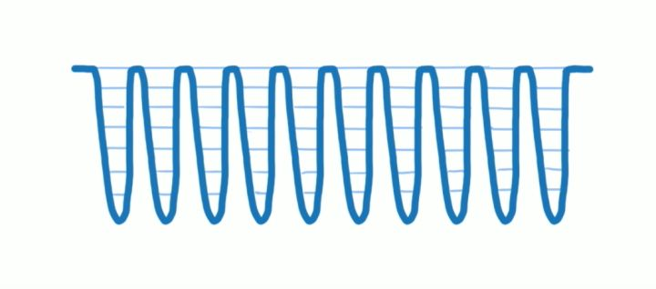
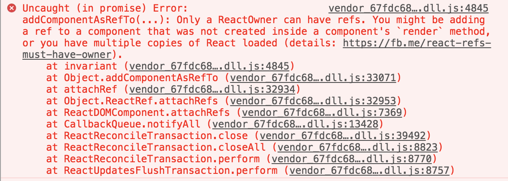

# React 16 新特性及升级指南

## 支持 fragments (数组) 与字符串类型
React 16的render方法返回可以是数组，不用在外面包一层父节点了
```javascript
render() {
  return [
    <li key="A">First item</li>,
    <li key="B">Second item</li>,
    <li key="C">Third item</li>,
  ];
}
```
也可以返回一个字符串，或者数组里有字符串
```javascript
//返回字符串
render() {
  return 'Didi';
}
//返回有字符串的数组
render() {
  return [
    'DIDI',
    < li key= "A" > First item</li >,
    < li key="B"> Second item</li >,
    'fe'
  ];
}
```
具体dom结构如图所示：


## 提供新的错误捕获方法componentDidCatch
当组件抛出JavaScript错误，整个页面都会处于无法操作的状态。

为了防止这样的情况出现，在React15及以前会采用```unstable_handleError```来捕获错误。

但是，这是个不稳定API，只能捕获当前组件首次渲染抛出的错误，经过试验，以下错误并不能被捕获：
- 子组件抛错
- 组件更新state，重新渲染抛错

React 16 采用了更稳定的API```componentDidCatch```，以上错误均能被捕获
具体用法如下：
```javascript
class ErrorBoundary extends React.Component {
  constructor(props) {
    super(props);
    this.state = { hasError: false };
  }

  componentDidCatch(error, info) {
    this.setState({ hasError: true });
    // 集中处理报错
    logErrorToMyService(error, info);
  }

  render() {
    if (this.state.hasError) {
      // 出错时显示的组件
      return <h1>Something went wrong.</h1>;
    }
    return this.props.children;
  }
}
//用法
<ErrorBoundary>
  <MyWidget />
</ErrorBoundary>
```
尝试在```<Router/>```外面增加ErrorBoundary，未成功捕获错误。

## 新的createPortal方法
以前，当我们在画Dialog，Tooltip等需要加到特定的dom层级（比如body）的组件时，都会使用```ReactDom.render```方法将其append到相应的真实dom树上。

而React 16提供新方法```createPortal```，虽然它将当前组件加到任意的dom树上，但在React树上，它仍然是加到了自身的父节点上，可以使用正常React子组件应有的特性：
- ```createPortal```不会丢失context，这对使用极度依赖于context的库如redux特别有用
- 可以在父组件捕获事件冒泡
来看一个简单的时间冒泡的例子

html结构：
```javascript
<div id="app-container"></div>
<div id="modal-container"></div>
```
通过```createPortal```, app-container可以捕获到modal-container的子节点发出的事件
```javascript
// 下面两个DOM是相邻的
const appContainer = document.getElementById('app-container');
const modalContainer = document.getElementById('modal-container');

class Parent extends React.Component {
  state = {clicks: 0};
  onClick = () => {
    // 它能够捕获Child组件发出的Click时间，即时它在真实dom树上不相干.
    this.setState(state => ({clicks: state.clicks + 1}));
  };
  render() {
    return (
      <div onClick={this.onClick}>
        <p>点击次数: {this.state.clicks}</p>
        <p>打开开发者工具，Child组件并不在拥有onClick handler的那个div下面，而是在modal-container下面.</p>
        {ReactDOM.createPortal(<Child />, modalContainer)}
      </div>
    );
  }
}

function Child() {
  return <button>Click</button>;
}

ReactDOM.render(<Parent />, appContainer);
```
[CodePen](https://codepen.io/acdlite/pen/MEJEVV)

## 更好的服务端渲染

服务器端渲染的特性被完全重写以支持数据流（streaming）。React核心团队成员Sasha Aicken写了一篇文章来描述 [React16服务器端渲染的提升](https://hackernoon.com/whats-new-with-server-side-rendering-in-react-16-9b0d78585d67)。

React 16的服务端渲染相对于15提升了3倍的性能。

## 支持自定义dom属性

在React 15及以前，自定义的dom属性会被忽略，而16版本会将自定义属性直接展示在dom树上
例如下面的用法会使得```mycustomattribute```属性出现在dom树上。
```javascript
ReactDOM.render(
  <h1 mycustomattribute="hello">Hello, world!</h1>,
  document.getElementById("root")
);
```
## 打包后的体积减小
相对于之前的15.6.1版本，react + react-dom 整体的打包体积减小32%
react从之前的20.7kb(gzip后6.9kb)减小到5.3kb(gzip后2.2kb)
react-dom从之前的141kb(gzip后42.9kb)减小到103kb(gzip后32.6kb)

React 16采用了Rollup的打包方式，不仅仅体积缩小了，而且运行时性能也提升了。

⚠️ 总结一下，App用功能更强大的webpack打包, 而Library用rollup打包，体积更小，性能更好。

## 新的核心算法Fiber
Fiber是facebook用了两年多的时间对核心算法的重新实现，它能够提高复杂应用的性能。

#### React 16 之前大量组件更新问题
JavaScript是单线程，所以当React组件进行大量更新State时候，就造成主线程的阻塞，造成界面的卡顿，用户无法进行操作，带来非常糟糕的用户体验。

如下图所示，当一个很大的组件树需要更新状态时，会更新所有的组件直到结束，这也使得调用栈非常深。


#### React 16 Fiber解决了瓶颈
Fiber重新实现了调用栈，可以称之为虚拟栈，它采用了任务碎片化的方式来解决了大量更新的问题。

该算法每执行完一段更新过程都会把控制权交给React的协调模块，如果有更高优先级的任务（比如Input输入）就优先去做，如果没有就继续更新组件。

如下图所示，波谷是执行更新的过程，而波峰则是尝试更高优先级任务的过程。


#### React Fiber对现有代码的影响
React Fiber一个更新过程分为两个阶段：第一个阶段Reconciliation Phase和第二阶段Commit Phase

如下图所示


以前的React，每个生命周期函数只会在一次更新中被调用一次，而现在可能会被调用多次，所以会产生一些副作用。
对于第二阶段的函数，因为无法被打断，所以跟以前一样
- componentDidMount
- componentDidUpdate
- componentWillUnmount

对于第一阶段的函数，我们需要特别注意，它们是会被打断了
- componentWillMount
- componentWillReceiveProps
- shouldComponentUpdate
- componentWillUpdate

这其中 ```componentWillMount```和```componentWillUpdate```多次执行往往会包含副作用，要特别注意。

## React 16升级过程中遇到的问题

#### react-highlight暂时不支持react16
有workaround解决，详情请见[react-highlight-16-issue](https://github.com/akiran/react-highlight/issues/39#issuecomment-334898100)

#### Library千万不要把React作为dependencies
因为这样会导致App打包出现两个React，App依赖于16而Library依赖于15。

解决办法：Library把React作为peerDependencies

#### 本地环境无问题，测服出现两个React的报错
具体错误为：Error: addComponentAsRefTo(...): Only a ReactOwner can have refs. You might be adding a ref to a component that was not created inside a component's `render` method, or you have multiple copies of React loaded (details: https://fb.me/react-refs-must-have-owner).
报错截图如下所示：

原因是vendor.dll里有之前打包的React 15

解决办法：更新vendor.dll以及vendor.manifest.json

## 参考
- [React 16](https://reactjs.org/blog/2017/09/26/react-v16.0.html)
- [React 16 error handler](https://reactjs.org/blog/2017/07/26/error-handling-in-react-16.html)
- [React 16 portals](https://reactjs.org/docs/portals.html)
- [React Fiber是什么](https://zhuanlan.zhihu.com/p/26027085)
