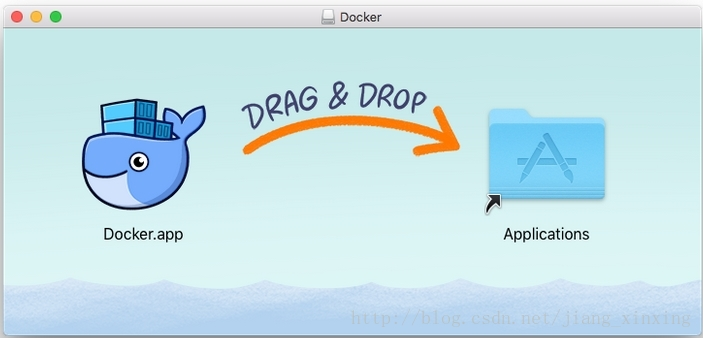
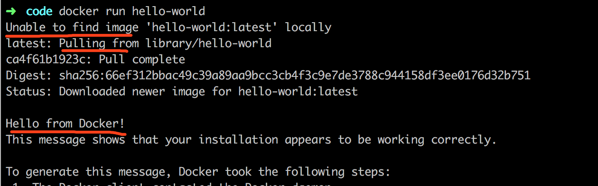
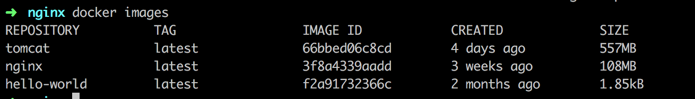

## Mac下docker安装nginx并配置反向代理实现前后端分离

[返回首页](../../README.md)

1、安装docker


下载地址：[https://download.docker.com/mac/stable/Docker.dmg](https://download.docker.com/mac/stable/Docker.dmg)





检查版本:


```shell

$ docker --version

Docker version 1.13.0, build 49bf474

```


验证是否安装成功：




* * *

2、查看docker当前镜像是否包含nginx


```shell

$docker images

```





如果list没有nginx，那就要安装了，方法如下：


```shell

$ docker pull nginx

```


3、准备需要挂载的目录和文件


这里说一下挂载的概念：把宿主机器下的目录挂载到容器内，那么宿主机的任何改动都会映射到容器中去，就不需要去进入容器中操作了。只要将主机的目录挂载到容器的目录上，那改变就会立即生效。且能够保持数据的持久化，不会因为容器销毁了配置数据丢失。因此，方便创建新的容器副本。


在当前目录nginx下创建三个目录，conf、log、www


```shell

conf存放nginx的配置文件，log存放nginx的日志，www存放静态文件

```


```shell

$ tree

.

├── conf

│   └── nginx.conf

├── log

│   ├── access.log

│   └── error.log

└── www

    └── index.html

```


以下是nginx.conf内容:


```shell

user www-data;

worker_processes auto;

pid /run/nginx.pid;


events {

    worker_connections 768;

    # multi_accept on;

}


http {


    ##

    # Basic Settings

    ##


    sendfile on;

    tcp_nopush on;

    tcp_nodelay on;

    keepalive_timeout 65;

    types_hash_max_size 2048;

    # server_tokens off;


    # server_names_hash_bucket_size 64;

    # server_name_in_redirect off;


    include /etc/nginx/mime.types;

    default_type application/octet-stream;


    ##

    # SSL Settings

    ##


    ssl_protocols TLSv1 TLSv1.1 TLSv1.2; # Dropping SSLv3, ref: POODLE

    ssl_prefer_server_ciphers on;


    ##

    # Logging Settings

    ##


    access_log /opt/nginx/log/access.log;

    error_log /opt/nginx/log/error.log;


    ##

    # Gzip Settings

    ##


    gzip on;

    gzip_disable "msie6";


    ##

    # Virtual Host Configs

    ##


    server {

        listen 80 default_server;

        listen [::]:80 default_server;


        root /opt/nginx/www;


        # Add index.php to the list if you are using PHP

        index index.html index.htm index.nginx-debian.html;


        server_name _;


        location / {

            # First attempt to serve request as file, then

            # as directory, then fall back to displaying a 404.

            try_files $uri $uri/ =404;

        }


    }

}

```


在www下创建测试html，index.html:

```shell

<!DOCTYPE html>
<html>
<head>
<title>Welcome to nginx!</title>
</head>
<body>
<h2>Hello docker nginx</h1>
</body>
</html>

```


4、下面就要把宿主机下的文件挂载到通过nginx创建的容器中区


```shell

$docker run -p 8093:80 --name mynginx  -v $PWD/conf/nginx.conf:/etc/nginx/nginx.conf -v $PWD/www:/opt/nginx/www -v $PWD/log:/opt/nginx/log  -d nginx

```


命令说明：


-p8093:80：将容器的80端口映射到主机的8093端口


-namemynginx：将容器命名为mynginx


-v$PWD/conf/nginx.conf:/etc/nginx/nginx.conf：将主机中当前目录下的nginx.conf挂载到容器的/etc/nginx/nginx.conf


-v$PWD/www:/opt/nginx/www：将主机中当前目录下的www挂载到容器的/opt/nginx/www，参考nginx.conf的root配置


-v$PWD/log:/opt/nginx/log：将主机中当前目录下的log挂载到容器的/opt/nginx/log，参考nginx.conf的log配置


顺利的话，在浏览器中输入http://localhost:8093/ 应该能看到Hello docker nginx

* * *

5、配置Nginx反向代理


打开刚刚宿主机中创建的用来挂载Nginx配置的文nginx.conf，并添加以下内容：


```shell

server {

    ...

    location /api {

        proxy_set_header  Host  $http_host;

        proxy_set_header  X-Real-IP  $remote_addr;

        proxy_set_header  X-Forwarded-For $proxy_add_x_forwarded_for;

        proxy_pass  http://宿主机IP:8080;

    }

}

```


注意这里宿主机一定要是IP，这样就成功把所有/api的请求代理到8080端口了！


教程参考http://www.runoob.com/docker/docker-install-nginx.html

> 作者简介

```

                   .-' _..`.

                  /  .'_.'.'

                 | .' (.)`.

                 ;'   ,_   `.

 .--.__________.'    ;  `.;-'

|  ./               /

|  |               /

`..'`-._  _____, ..'

     / | |     | |\ \

    / /| |     | | \ \

   / / | |     | |  \ \

  /_/  |_|     |_|   \_\

 |__\  |__\    |__\  |__\

 ```
 **马群晶**滴滴海浪前端团队（海浪FE）高级前端工程师，致力于Vue、活动自动化构建平台的研发与布道。


