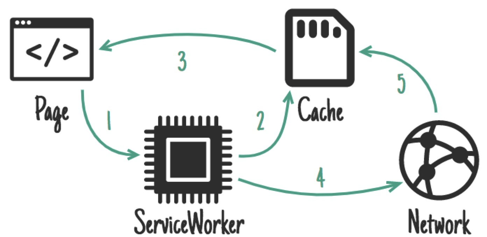

使用 AppCache 可为我们提供支持内容离线工作的几种模式。如果这些模式正是你所需的，那么恭喜你，你中了AppCache彩票大奖（头奖没人认领），但是剩下的我们被挤在角落,[来回摇摆](http://alistapart.com/article/application-cache-is-a-douchebag)。

有了SeviceWorker，我们放弃了解决离线的尝试，留给开发者移动的部分来自己解决它们。她给了你缓存的控制力，和请求如何处理。这意味着你能够自己创造自己的模式。让我们隔离地看一些可能的模式，但是，在实践中，你可能根据URL和context用到一系列的模式。

除非另有说明，否则所有代码示例均适用于Chrome和Firefox.更详细的关于Service Worked的支持，请查看[”Service Worker是否已就绪？”](https://jakearchibald.github.io/isserviceworkerready/)。

对于其中部分模式的运行演示，请查看 [Trained-to-thrill](https://jakearchibald.github.io/trained-to-thrill/)，以及展示性能影响的[视频](https://www.youtube.com/watch?v=px-J9Ghvcx4)。

## 缓存引擎-何时存储资源
ServiceWorker 允许你独立地从缓存来处理请求，因此我们可以将他们分开来看。首先，何时进行缓存

### 安装时 - 作为一个依赖

ServiceWorker 提供了一个install的事件。你可以用它把那些需要在别的事件中用到的东西准备好。当你安装的时候，之前任何版本的ServiceWorker还在运行和为页面提供服务，因此你现在做的这些操作，一定不要影响或打断它。

适合于：CSS,Images,fonts,JS,templates...基本上所有你能想要为这个版本静态化的文件

```js
self.addEventListener('install', function(event) {
     event.waitUntil( caches.open('mysite-static-v3').then(function(cache) {
        return cache.addAll([
            '/css/whatever-v3.css’,
            '/css/imgs/sprites-v6.png’,
             '/css/fonts/whatever-v8.woff’,
            '/js/all-min-v4.js' // etc
            ]);
        });
    );
});
```
Event.waitUntil 用一个promise来定义安装时长和成功与否。如果这个promise拒绝了，安装就被认为失败了，这个ServiceWorker就将被废弃（如果一个旧版本在运行，它会完整的被保留下来），caches.open 和 cache.addAll返回promise。如果任何资源获取失败，cache.addAll就会返回reject

### 安装时 - 不作为一个依赖

与上面的类似，但是如果缓存失败，不会导致延迟安装完成，也不会导致安装失败.

适合于：大点的资源不是即时需要的，比如游戏后面阶段的资源。

```js
self.addEventListener('install', function(event) {
     event.waitUntil(
         caches.open('mygame-core-v1').then(function(cache) { 
            cache.addAll( 
            // levels 11-20
             ); 
            return cache.addAll(
             // core assets & levels 1-10
             );
        })
     );
});
```

我们没有将```cache.addAll```11-20关的promise传给```event.waitUntil```。 所以即使失败了，游戏依然离线可用。当然，你应该要考虑到这个关卡缺失的可能性。如果他们不存在，再尝试重新缓存他们。

当11-20关下载的时候，一旦我能成了处理程序， ServiceWorker可能在这个时候被终止，这意味着他们不会被缓存。在未来，我们机会增加后台下载API来处理类似的案例，还有更大点的下载，例如电影。

### 在激活的时候


适合于：清理和迁移

一旦一个新的ServiceWorker被安装，之前的一个版本的就不再被使用了，一个新的激活，有一个`activate`事件。以为老的版本已经不存在，这是一个来处理在IndexedDB中的schema迁移，和删除无用缓存的好时机。

```js
self.addEventListener('activate', function(event) {
  event.waitUntil(
    caches.keys().then(function(cacheNames) {
      return Promise.all(
        cacheNames.filter(function(cacheName) {
          // Return true if you want to remove this cache,
          // but remember that caches are shared across
          // the whole origin
        }).map(function(cacheName) {
          return caches.delete(cacheName);
        })
      );
    })
  );
});
```

当激活时，其他的事件，比如`fetch`被放在队列中，因此，一个长的激活可能阻塞页面的加载。将你的激活事件尽量精简，只用它执行旧版本激活时不能做的操作。

### 在用户交互时


适合于：如果整个网站不能离线访问，你可以允许用户选择他们相互要离线可用的内容，例如，一个视频在类似YouTube
的网站，一篇文章在维基百科，一个特别的画廊在Flickr。

给用户提供一个"稍后阅读"或者"保存为离线"的按钮。点击时，从网络获取你所需的内容，将它放在缓存中。

```js
document.querySelector('.cache-article').addEventListener('click', function(event) {
  event.preventDefault();

  var id = this.dataset.articleId;
  caches.open('mysite-article-' + id).then(function(cache) {
    fetch('/get-article-urls?id=' + id).then(function(response) {
      // /get-article-urls returns a JSON-encoded array of
      // resource URLs that a given article depends on
      return response.json();
    }).then(function(urls) {
      cache.addAll(urls);
    });
  });
});
```

缓存API页面和网络都可用，意味着你不必让ServiceWorker来添加东西到缓存中。

### 网络返回时


适合于：频繁地更新资源，例如一个用户的收件箱，活文章内容。同时也对非必须的内容有用，例如头像
，但是要小心。

如果一个请求在缓存中匹配不到任何东西，就从网络获取，发给页面，同时添加到缓存中。

如果你为一系列网址执行这个操作，比如头像，你必须要小心，不要让你的站点存储空间膨胀-如果用户需要回收磁盘空间，你就不必成为主要的候选人。确保你摆脱了你不在需要的缓存。

```js
self.addEventListener('fetch', function(event) {
  event.respondWith(
    caches.open('mysite-dynamic').then(function(cache) {
      return cache.match(event.request).then(function (response) {
        return response || fetch(event.request).then(function(response) {
          cache.put(event.request, response.clone());
          return response;
        });
      });
    })
  );
});
```

为了更有效的利用内存，你可以只读取响应/请求体一次。在上面的代码中，`.clone()`被用来创建额外的，可以被单独读取的拷贝。

### Stale-while-revalidate



适合于： 频繁更新最新版本的资源是非必需的。头像属于此类。

如果存在一个可用的缓存版本，就使用，但在下次获取更新版本。

```js
self.addEventListener('fetch', function(event) {
  event.respondWith(
    caches.open('mysite-dynamic').then(function(cache) {
      return cache.match(event.request).then(function(response) {
        var fetchPromise = fetch(event.request).then(function(networkResponse) {
          cache.put(event.request, networkResponse.clone());
          return networkResponse;
        })
        return response || fetchPromise;
      })
    })
  );
});
```
这与 HTTP 的 [stale-while-revalidate](https://www.mnot.net/blog/2007/12/12/stale) 非常相似。

### 在推送消息时


推送API是基于ServiceWorker的另一个特点。他允许ServiceWorker被唤醒，来响应来自系统消息服务。即使当用户没有点击打开你的站点，他同时会触发，只有ServiceWorker被唤醒。你请求在一个页面上这样做的权限，用户就会收到提示。

理想情况：与通知有关的内容，例如一个聊天信息，一个突发的新闻报道，或是一封电子邮件即使更新也不经常更改的内容，例如待办项列表或者日历更改。

共同的，最终产物是一个通知，当点击，打开/聚焦到一个相应页面，但是在之前更新是极其重要的。
用户收到推送消息时，明显是在线的，但是当收到消息通知交互的时候不一定在，因此将内容离线可用非常重要。Twitter原生App，很大程度上是一个出色的离线可用的例子 - 这点有点不对劲

断了联接，Twitter在提供与推送消息相关的内容时失败了。点击也没去掉通知，使用户获取的信息少于他们点击之前的。别这样做。

这些代码在显示通知之前更新缓存。

```js
self.addEventListener('push', function(event) {
  if (event.data.text() == 'new-email') {
    event.waitUntil(
      caches.open('mysite-dynamic').then(function(cache) {
        return fetch('/inbox.json').then(function(response) {
          cache.put('/inbox.json', response.clone());
          return response.json();
        });
      }).then(function(emails) {
        registration.showNotification("New email", {
          body: "From " + emails[0].from.name
          tag: "new-email"
        });
      })
    );
  }
});

self.addEventListener('notificationclick', function(event) {
  if (event.notification.tag == 'new-email') {
    // Assume that all of the resources needed to render
    // /inbox/ have previously been cached, e.g. as part
    // of the install handler.
    new WindowClient('/inbox/');
  }
});
```

### 后台同步时


后台同步时是另一个建立在ServiceWorker的功能。它允许你同步请求后台数据作为一次性，活在一个（非常启发式）间隔。即使当用户没有打开一个你网站的选项卡，这个也会发生，只要ServiceWorker被唤醒。你请求从页面这个操作的权限，用户会收到通知。

适合于：非紧急地更新，特别是那些经常发生，推送消息每次更新太频繁，例如社交时间或新文章。
```js
self.addEventListener('sync', function(event) {
  if (event.id == 'update-leaderboard') {
    event.waitUntil(
      caches.open('mygame-dynamic').then(function(cache) {
        return cache.add('/leaderboard.json');
      })
    );
  }
});
```

## 缓存持久性

你的出发点给了一定的自由空间来做你想做的。这个可用空间在所有原始存储之间共享：LocalStorage,IndexedDB,Filesystem,还有Caches。
你获得的数量是不具体的，它会因设备和存储条件而已。你可以找出你已经获得了多少通过：
```js
navigator.storageQuota.queryInfo("temporary").then(function(info) {
  console.log(info.quota);
  // Result: <quota in bytes>
  console.log(info.usage);
  // Result: <used data in bytes>
});
```
然而，像所有浏览器存储，如果设备在存储变得有压力的时，浏览器是自由释放的。不幸的是，浏览器不能区分那些你不惜任何代价想要保留的电影，和你完全不在乎的游戏的差别。
为了解决这个问题，有一个建议的API，requestPersistent:
```js
// From a page:
navigator.storage.requestPersistent().then(function(granted) {
  if (granted) {
    // Hurrah, your data is here to stay!
  }
});
```
当然，用户必须予以授权。让用户成为这个流程的一部分非常重要，因为我们现在可以期望他们能够控制删除。如果她们的设备有存储压力，同时清理不必要的数据不能解决他，用户就可以做个判定哪些需要保留或移除。
为了能让他起作用，他需要文件系统在他们存储使用崩溃的时候。拿"耐久"的源等同于原省应用来对待，而不是将浏览器报告为单个项目。

## 服务建议-响应请求
无论你做了多少缓存都没关系，ServiceWorker不使用缓存，除非你告诉他什么时候，以何种方式。这里有集中处理请求的模式。
### 仅缓存 

适合于：任何你考虑想要为你网站某个版本静态化的东西。你应该已经在安装事件里缓存过了，因此你可以依赖哪些已经存在的。
```js
self.addEventListener('fetch', function(event) {
  // If a match isn't found in the cache, the response
  // will look like a connection error
  event.respondWith(caches.match(event.request));
});
```
尽管你不用经常需要特殊处理这个案例，"Cache, falling back to network"能够兼顾到这个。
### 仅网络

适合于：没有离线的等价物，例如分析ping，非get请求
```js
self.addEventListener('fetch', function(event) {
  event.respondWith(fetch(event.request));
  // or simply don't call event.respondWith, which
  // will result in default browser behaviour
});
```
尽管如此，你不必经常特殊处理这种案例，"Cache, falling back to network"能都涵盖它
### 缓存、回退到网络

适合于：如果您是以离线优先的方式构建的，那么您将如何处理大部分请求。其他模式将基于传入请求进行异常处理
```js
self.addEventListener('fetch', function(event) {
  event.respondWith(
    caches.match(event.request).then(function(response) {
      return response || fetch(event.request);
    })
  );
});
```
这个使当你缓存里有的话以"Cache Only"来处理，没有缓存（包括所有非Get请求，因为它们没办法缓存）的话以"Network Only"
### 缓存和网络竞竞争

适合于：在慢速访问的磁盘设备上追逐性能的小型资源。
通过一些旧点的硬件驱动，病毒扫描程序，更快的网络连接的组合，使得通过网络获得资源比磁盘上的更快。然而，当用户在他们设备上已经有对应的内容，而去网络获取，会是对数据的一种浪费，所以你应该考虑这一点。
```js
// Promise.race is no good to us because it rejects if
// a promise rejects before fulfilling. Let's make a proper
// race function:
function promiseAny(promises) {
  return new Promise((resolve, reject) => {
    // make sure promises are all promises
    promises = promises.map(p => Promise.resolve(p));
    // resolve this promise as soon as one resolves
    promises.forEach(p => p.then(resolve));
    // reject if all promises reject
    promises.reduce((a, b) => a.catch(() => b))
      .catch(() => reject(Error("All failed")));
  });
};

self.addEventListener('fetch', function(event) {
  event.respondWith(
    promiseAny([
      caches.match(event.request),
      fetch(event.request)
    ])
  );
});
```
### 网络回退到缓存

适合于：一个快速修改对于更新频繁的资源，没有版本概念的，例如文章，头像，社交时间表，游戏排行榜。
这意味着你提供给用户绝大多数最新的内容，但是离线用户拿到一个旧点的缓存版本。如果网络请求成功，你可以更愿意去更新缓存条目。
然而，这个方法有弊端。如果用户有个断断续续或缓慢的连接，他们必须等待网络失败，然后才能得到已存在设备上的完美的可接受的内容。这个消耗相当长的一段时间，这是个令人失望的用户体验。看下下一个模式，"Cache then network"，一个更好的解决方案。
```js
self.addEventListener('fetch', function(event) {
  event.respondWith(
    fetch(event.request).catch(function() {
      return caches.match(event.request);
    })
  );
});
```
### 缓存然后访问网络

适合于：更新很频繁的内容，例如文章，社交时间表，游戏排行榜。
这要求页面发两个请求，一个到缓存，一个到网络。这个思路是先展示缓存里的数据，然后更新页面当/如果网络数据到达。
有时你可以仅替换当前的数据当一个新的数据到达的时候（例如游戏排行榜），但是这可能会对大型的内容造成破坏性的影响。基本上，不要让用户的可能看到或者交互的东西消失。
Twitter在旧内容之上添加新内容，适配滚动位置，因此用户不会受影响。这是可能的，因为Twitter主要保留内容的大部分线性顺序。我将这种模式复制到训练有素的快感中，尽可能快的获取内容到屏幕上，但是一旦到达，仍然会显示最新的内容。
页面代码：
```js
var networkDataReceived = false;

startSpinner();

// fetch fresh data
var networkUpdate = fetch('/data.json').then(function(response) {
  return response.json();
}).then(function(data) {
  networkDataReceived = true;
  updatePage();
});

// fetch cached data
caches.match('/data.json').then(function(response) {
  if (!response) throw Error("No data");
  return response.json();
}).then(function(data) {
  // don't overwrite newer network data
  if (!networkDataReceived) {
    updatePage(data);
  }
}).catch(function() {
  // we didn't get cached data, the network is our last hope:
  return networkUpdate;
}).catch(showErrorMessage).then(stopSpinner);
```
ServiceWorker代码：
我们经常连接网络，更新缓存
```js
self.addEventListener('fetch', function(event) {
  event.respondWith(
    caches.open('mysite-dynamic').then(function(cache) {
      return fetch(event.request).then(function(response) {
        cache.put(event.request, response.clone());
        return response;
      });
    })
  );
});
```
这上面的还不能在chrome里运行，因为我们还未暴露`fetch`和`caches`到页面。
在trained-to-thrill里，我用XHR来代替fetch，并滥用Accept头部以告知ServiceWorker从哪里获取结果（页面代码，ServiceWorker代码）
### 常规回退

如果你从缓存或者网络服务一些东西失败了，你可能提供一个通用的回退。
适合于：次要图像，例如头像，失败的POST请求，"脱机时不可用"页面。
```js
self.addEventListener('fetch', function(event) {
  event.respondWith(
    // Try the cache
    caches.match(event.request).then(function(response) {
      // Fall back to network
      return response || fetch(event.request);
    }).catch(function() {
      // If both fail, show a generic fallback:
      return caches.match('/offline.html');
      // However, in reality you'd have many different
      // fallbacks, depending on URL & headers.
      // Eg, a fallback silhouette image for avatars.
    })
  );
});
```
您回退的项目很可能是安装依赖项。
如果你的页面发送一封邮件，你的ServiceWorker可能回退到存储在IDB的"发件箱"中,响应让页面知道发送失败但是数据被成功的保留。
### ServiceWorker-side templating

适合于：无法缓存服务器响应的页面。
在服务器渲染页面让所有都变得很快，但是那意味着包含在缓存中毫无意义的状态数据。例如："登录作为...".如果你的页面受控于ServiceWorker，你也可以选择请求JSON数据一级模板，然后进行渲染。
```js
importScripts('templating-engine.js');

self.addEventListener('fetch', function(event) {
  var requestURL = new URL(event.request);

  event.respondWith(
    Promise.all([
      caches.match('/article-template.html').then(function(response) {
        return response.text();
      }),
      caches.match(requestURL.path + '.json').then(function(response) {
        return response.json();
      })
    ]).then(function(responses) {
      var template = responses[0];
      var data = responses[1];

      return new Response(renderTemplate(template, data), {
        headers: {
          'Content-Type': 'text/html'
        }
      });
    })
  );
});
```
## 总结
你不必非从中选一种方法，你根据请求的URL可能使用很多种。例如，trained-to-thrill 使用了：
- 在安装时缓存，适用于静态 UI 和行为
- 在网络进行响应时缓存，适用于 Flickr 图像和数据
- 从缓存获取、回退到网络，适用于大多数请求
- 从缓存获取，然后访问网络，适用于 Flickr 搜索结果


看请求决定该采取的措施
```js
self.addEventListener('fetch', function(event) {
  // Parse the URL:
  var requestURL = new URL(event.request.url);

  // Handle requests to a particular host specifically
  if (requestURL.hostname == 'api.example.com') {
    event.respondWith(/* some combination of patterns */);
    return;
  }
  // Routing for local URLs
  if (requestURL.origin == location.origin) {
    // Handle article URLs
    if (/^\/article\//.test(requestURL.pathname)) {
      event.respondWith(/* some other combination of patterns */);
      return;
    }
    if (/\.webp$/.test(requestURL.pathname)) {
      event.respondWith(/* some other combination of patterns */);
      return;
    }
    if (request.method == 'POST') {
      event.respondWith(/* some other combination of patterns */);
      return;
    }
    if (/cheese/.test(requestURL.pathname)) {
      event.respondWith(
        new Response("Flagrant cheese error", {
          status: 512
        })
      );
      return;
    }
  }

  // A sensible default pattern
  event.respondWith(
    caches.match(event.request).then(function(response) {
      return response || fetch(event.request);
    })
  );
});
```
